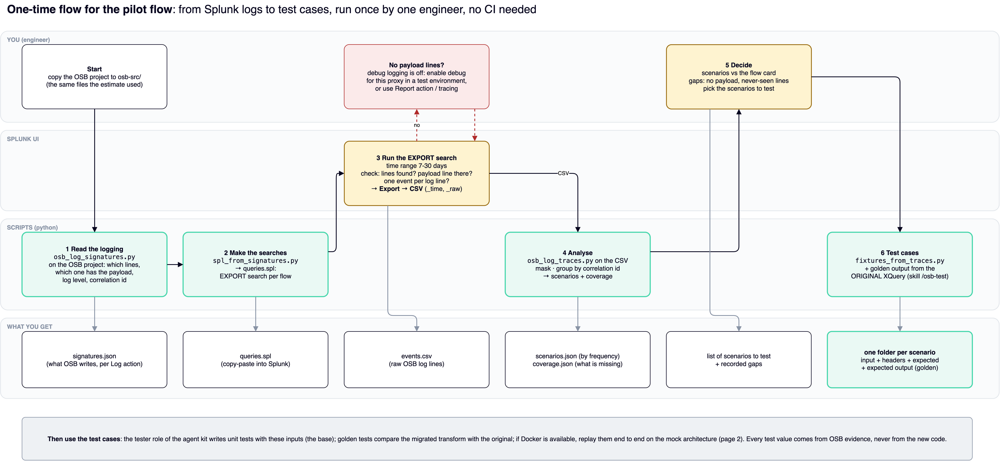

# osb-log-replay

Turn OSB logs from Splunk into test cases for the migrated Camel flows.

You give it two things:
1. the **OSB project files** (`.pipeline` / `.proxy`);
2. the **OSB log lines exported from Splunk**.

You get back one folder per test scenario, holding the real input message, its headers and the expected result.
Those are the inputs for the unit tests the agent kit writes, and for an optional end-to-end replay.



---

## 1. What you need

| Need | Why |
|---|---|
| Python 3.10 or newer | all scripts; standard library only |
| The OSB project folder | e.g. `my-flow-prj/` with its `Pipeline/*.pipeline` and `Proxy_Service/*.proxy` files |
| Read access to Splunk (the UI is enough) | to run one search and export it as CSV |
| The Splunk **index** and **sourcetype** of the OSB server logs | ask the Splunk owner |
| *Optional:* Docker | only for the end-to-end replay (section 6) |

Nothing to install for steps 1–5. The replay runner (step 6) needs `stomp.py`, installed inside its container.

---

## 2. Quick start: try it on the bundled sample (2 minutes)

```bash
cd osb-log-replay
./run_offline.sh                       # runs steps 1, 2, 4, 5 on the synthetic sample, results in ./work
python3 -m unittest discover -s tests  # 15 unit tests, should print OK
```

Open `work/traces/scenarios.json` and `work/fixtures/parity/` to see what you will get for a real flow.

---

## 3. Use it on your flow, step by step

### Step 0. Put the OSB files in place
```bash
mkdir -p osb-src work
cp -r /path/to/my-flow-prj osb-src/
```

### Step 1. Read the logging from the OSB source → `tools/osb_log_signatures.py`
```bash
python3 tools/osb_log_signatures.py osb-src -o work/signatures.json
```
It finds every **Log action** in the pipelines and records, per action:
- what the log line looks like;
- which part of it is the message body;
- its log level;
- which field links the lines of one message (correlation id).

Read the printed summary and any warnings. If the line with the body is `debug`, it is probably not written in
production (see step 3).

### Step 2. Make the Splunk searches → `tools/spl_from_signatures.py`
```bash
python3 tools/spl_from_signatures.py work/signatures.json --index <index> --sourcetype <sourcetype> -o work/queries.spl
```
`work/queries.spl` contains, per flow:
- **EXPORT** search: run this one and export it;
- **TRACES** search: groups the lines per message, for looking only;
- one search per log line: to check that the fields are extracted.

### Step 3. Export the log lines from Splunk (you, in the Splunk UI)
1. Paste the **EXPORT** search and set the time range to 7–30 days.
2. Check three things:
   - lines are found;
   - the line with the message body is there;
   - a multi-line message shows as **one** event.
3. **Export → CSV** and save the file as `work/events.csv`. It needs the `_time` and `_raw` columns, which the
   EXPORT search already returns.

**No line with the body?** Debug logging is off. Either enable debug for that proxy in a test environment and export
from there, or use OSB Report actions or message tracing if they are on.

*Without the UI:* `tools/splunk_export.py` does the same export through the Splunk REST API. The token is read from
the `SPLUNK_TOKEN` environment variable:
```bash
SPLUNK_TOKEN=... python3 tools/splunk_export.py --url https://<splunk>:8089 --search '<EXPORT search>' \
    --earliest -30d --latest now -o work/events.jsonl
```

### Step 4. Analyse → `tools/osb_log_traces.py`
```bash
python3 tools/osb_log_traces.py work/signatures.json work/events.csv -o work/traces
```
It reads the CSV (a Splunk JSON export and raw server logs work too, in either OSB format: classic WebLogic `####<…>` or the 12c **ODL** diagnostic log `[2026-…] [server] [NOTIFICATION] … [ecid: …]`) and:
- **masks personal data:** long ID numbers, e-mail addresses, and the values of JSON fields with names, birth dates, identity and contact data. The same value always gets the same mask, and the payload stays valid JSON;
- **groups the lines into one trace per message;**
- **sorts the traces into scenarios:** success or error × header values × error code.

| Output | What to read in it |
|---|---|
| `work/traces/scenarios.json` | scenarios by frequency: the top ones are most of the traffic, the rare ones are where migrations break |
| `work/traces/coverage.json` | lines matched vs. read, traces without a body, Log actions never seen |
| `work/traces/traces.jsonl` | every trace with its masked lines (input for step 5) |

Useful options:
- `--dims hdr_resource,hdr_eventType` chooses which fields split the scenarios;
- `--mask-regex '<pattern>'` adds more masking;
- `--mask-json-key <field>` masks an extra JSON field (repeat for each client-specific field holding personal data, e.g. a name in Arabic). **Look at one masked payload before sharing fixtures.**

### Step 5. Produce the test cases → `tools/fixtures_from_traces.py`
First edit **`replay-config.json`** for your flow (see section 5). Then:
```bash
python3 tools/fixtures_from_traces.py work/traces/traces.jsonl replay-config.json -o work/fixtures --per-scenario 3
```
Result, one folder per test case:
```
work/fixtures/parity/<flow>/<scenario>/<trace-id>/
    input.payload    the real request message (masked)
    headers.json     its JMS headers, incl. the correlation id
    expected.json    expected outcome (success / error), destination queue, error code, error headers
work/fixtures/golden/MANIFEST.csv   every file marked "osb-recording" (accepted by gate G7 of the agent kit)
```
The logs do not contain the **output** message. Add `expected-output.xml` to each folder by running the
**original** OSB XQuery on `input.payload`: the golden test of the osb-to-camel skill does this.

### Step 6. Use the test cases (how to mock: [`docs/MOCKING_RUNBOOK.md`](docs/MOCKING_RUNBOOK.md))
- **Unit tests (the base):** copy `work/fixtures/parity` and `work/fixtures/golden/MANIFEST.csv` into the Camel
  module's `src/test/resources`, then run `/osb-test` in pi (agent kit). The tester writes unit tests with these inputs.
- **End-to-end replay (optional, needs Docker):** see section 6.

**One command for steps 1, 2, 4 and 5**, once `work/events.csv` exists:
```bash
SPLUNK_INDEX=<index> SPLUNK_SOURCETYPE=<sourcetype> ./run_offline.sh osb-src work/events.csv work
```

---

## 4. Which script does what

| Script | Step | Input | Output | Command |
|---|---|---|---|---|
| `tools/osb_log_signatures.py` | 1 | OSB project folder | `signatures.json` | `osb_log_signatures.py osb-src -o work/signatures.json` |
| `tools/spl_from_signatures.py` | 2 | `signatures.json` | `queries.spl` | `spl_from_signatures.py work/signatures.json --index I --sourcetype S -o work/queries.spl` |
| `tools/splunk_export.py` | 3 (optional) | a search + `SPLUNK_TOKEN` | `events.jsonl` | `splunk_export.py --url U --search Q --earliest -30d -o work/events.jsonl` |
| `tools/osb_log_traces.py` | 4 | `signatures.json` + `events.csv` / `.jsonl` / `.log` | `traces.jsonl`, `scenarios.json`, `coverage.json` | `osb_log_traces.py work/signatures.json work/events.csv -o work/traces` |
| `tools/fixtures_from_traces.py` | 5 | `traces.jsonl` + `replay-config.json` | `parity/…` folders + `MANIFEST.csv` | `fixtures_from_traces.py work/traces/traces.jsonl replay-config.json -o work/fixtures` |
| `tools/replay_runner.py` | 6 (optional) | `replay-config.json` + fixtures | `report.json`, `junit.xml` | run through Docker, see section 6 |
| `tools/broker_setup_commands.py` | 6 (optional) | `replay-config.json` | broker CLI commands | used by `mock/setup_broker.sh` |
| `run_offline.sh` | 1, 2, 4, 5 | OSB folder + events file | everything in `work/` | `./run_offline.sh osb-src work/events.csv work` |

All scripts print their options with `-h`.

---

## 5. `replay-config.json` (one entry per flow)

```json
"my-flow-prj/my-flow": {
  "input":  {"address": "<input topic or queue>", "type": "multicast",
             "subscription": "<subscription queue>", "filter": "<the proxy's JMS selector>"},
  "correlation_header": "traceId",
  "outputs": {
    "success": {"destination": "<output queue>", "type": "anycast"},
    "error":   {"destination": "<error queue>",  "type": "anycast",
                "expect_headers": ["errorCode", "errorMessage", "traceId"]}
  },
  "negative_cases": [{"name": "filtered out", "headers": {"eventType": "created"}}],
  "timeout_s": 15
}
```

- **The key** is `<project folder>/<pipeline name>`, as printed in step 1.
- **Queue names** are the names on the **new** broker, not the WebLogic JNDI names.
- **`negative_cases`** are messages the proxy's selector must drop. OSB never logs those, so they come from the proxy
  configuration, not from Splunk.

---

## 6. End-to-end replay (optional, needs Docker)

Runs the test cases through a mock broker against the real Camel flow:

```bash
cd mock
cp .env.example .env                         # set ARTEMIS_PASSWORD and SUT_IMAGE (the Camel flow image)
docker compose up -d                         # Artemis broker + WireMock
./setup_broker.sh                            # creates the topic, the filtered subscription and the output queues
docker compose --profile selftest up -d      # optional: a stub flow to prove the setup first
docker compose --profile sut up -d           # the real Camel flow
docker compose --profile replay run --rm replay   # results in ../work/report/report.json and junit.xml
```

For each test case it publishes the input, waits for the message with the same correlation id, and checks:
- it went to the success or error queue as expected;
- the error headers are present;
- the body equals `expected-output.xml`, if present.

---

## 7. Folder layout

```
osb-log-replay/
  README.md               this file
  run_offline.sh          steps 1, 2, 4, 5 in one command
  replay-config.json      per-flow settings (edit for your flow)
  tools/                  the scripts (section 4)
  mock/                   Docker Compose mock: Artemis, WireMock, flow under test, stub, replay runner
  samples/                SYNTHETIC OSB pipeline and WebLogic log (invented values) used by the tests
  tests/                  unit tests for every script
  docs/ONE_TIME_FLOW.md   the step-by-step guide with checks and decisions
  docs/MOCKING_RUNBOOK.md how to mock: unit (no Docker), component (Testcontainers), end to end (Compose)
  templates/java/         RecordedCasesRouteTest (level 1), RecordedCasesBrokerIT (level 2)
  templates/wiremock/     backend stub template (reply, fault, timeout) from a business service
  docs/WORKFLOW.md        the method in depth: OSB logging, Splunk pitfalls, test layers
  docs/AUTOMATION.md      later, optional: running it automatically
  docs/*.drawio, *.png    diagrams: workflow, mock architecture, one-time flow, automation, how to mock
  skill/                  Agent Skill so an AI agent can run the steps
```

---

## 8. Troubleshooting

| Symptom | Likely cause | What to do |
|---|---|---|
| Step 1 finds 0 signatures | wrong folder level, or the project has no Log actions | point at the folder that contains the project folders; check the pipeline has Log actions |
| Warning "no correlation field" | the Log action does not write the message id | traces cannot be grouped; use another Log action, or add the id in a test environment |
| Splunk finds no lines | wrong index or sourcetype, time range, or the flow did not run | check with the Splunk owner; widen the time range |
| `traces_without_payload` is high | the body line is debug-level and off | enable debug for this proxy in a test environment (step 3) |
| One message shows as many events | Splunk event breaking splits multi-line lines | ask the Splunk owner, or use the raw WebLogic log files as input to step 4 |
| `events_unmatched` is high, matches low | the log line format differs from the pipeline expression | compare one `_raw` line with `signatures.json`; report the case |
| `coverage.json` shows `"formats": {"unknown": …}` | the log format is neither WebLogic nor ODL | send one line (personal data removed) to extend the parser |
| lines of one message are not grouped | the Log action does not write a trace id | ODL lines are grouped by their `ecid` automatically (`events_correlated_by_ecid`) |
| Step 5 skips scenarios | those traces have no body | expected, see the line above |

## Status

- **Steps 1–5 and the replay logic:** unit-tested on the synthetic sample.
- **Not yet run:** the Docker stack and the live broker connection; check the image tags and the Artemis CLI options
  on first use.
- **Before trusting the counts:** run step 1 and one Splunk search on a real export.

Background reading: [`docs/ONE_TIME_FLOW.md`](docs/ONE_TIME_FLOW.md) (guide), [`docs/MOCKING_RUNBOOK.md`](docs/MOCKING_RUNBOOK.md) (mocking), [`docs/WORKFLOW.md`](docs/WORKFLOW.md) (method).
