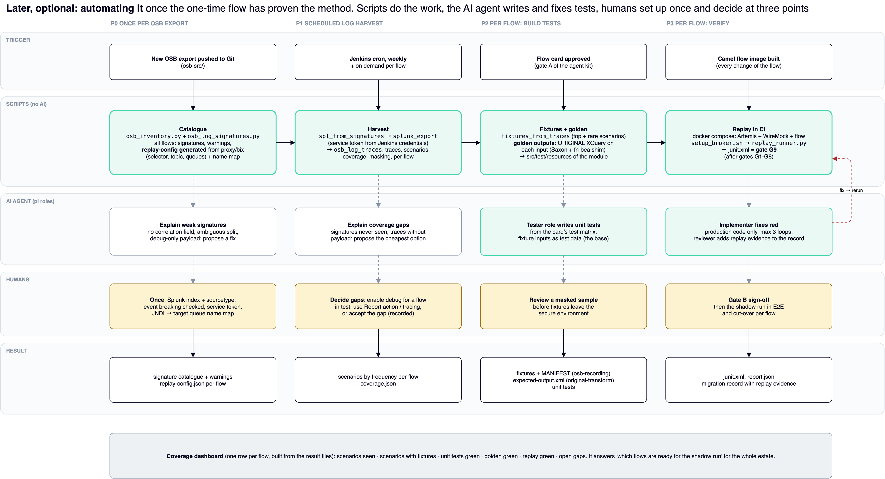

# Automation plan (later, optional)

Run the one-time flow in [ONE_TIME_FLOW.md](ONE_TIME_FLOW.md) first. Automate only after it has proven the method on the pilot flow.



**Principle:** deterministic scripts in CI do the repetitive work and decide pass or fail. The AI agent is used only
where judgement is needed: writing unit tests, fixing code, explaining gaps. Humans set things up once, then decide
at three points. Nothing the agent says counts as evidence; only script output does.

## Four phases, four triggers

| Phase | Trigger | What runs (scripts, no AI) | AI agent | Human | Result |
|---|---|---|---|---|---|
| **P0 Catalogue** | new OSB export pushed to Git | `osb_inventory.py` (agent kit) + `osb_log_signatures.py` for all flows; **`replay-config.json` generated** from the proxy and business services (topic, selector, queues) plus a JNDI → target-name map | explains weak signatures (no correlation, ambiguous split, debug-only payload) | once: Splunk index + sourcetype, event breaking checked, service token, name map | signature catalogue with warnings, replay config per flow |
| **P1 Harvest** | Jenkins cron (weekly) + on demand per flow | `spl_from_signatures.py` → `splunk_export.py` (token from Jenkins credentials) → `osb_log_traces.py` | explains coverage gaps and proposes the cheapest fix | decides gaps: enable debug for a flow in test, use Report action / tracing, or accept and record the gap | scenarios by frequency and coverage per flow |
| **P2 Build tests** | flow card approved (gate A of the agent kit) | `fixtures_from_traces.py` (top and rare scenarios); **golden outputs** from the original XQuery on each input; copy into the module's `src/test/resources` | **tester role writes unit tests** from the card's test matrix, using the fixtures (the base) | reviews a masked sample before fixtures leave the secure environment | fixtures + MANIFEST, golden outputs, unit tests |
| **P3 Verify** | Camel flow image built | Docker Compose mock (Artemis + WireMock + flow) → `setup_broker.sh` → `replay_runner.py` → junit = **gate G9**, after gates G1–G8 | implementer fixes red (production code only, max 3 loops); reviewer adds replay evidence to the record | gate B sign-off, then shadow run and cut-over | replay report, migration record with evidence |

A **coverage dashboard** built from the result files shows one row per flow: scenarios seen, scenarios with fixtures,
unit / golden / replay green, and open gaps. It answers "which flows are ready for the shadow run" across the estate.

## How it plugs into the agent kit

```
pi/run_flow.sh:  analyst → [gate A] → implementer → (P2: fixtures + golden) → tester → gates G1-G8 → (P3: replay = G9) → reviewer → [gate B]
```

- **P2 sits between the implementer and the tester,** so the tester writes unit tests on recorded inputs, not invented ones.
- **P3 adds gate G9 to `tools/verify_flow.sh`.** A red G9 sends the flow back into the existing fix loop.
- **P0 and P1 are not tied to a flow;** they run per export and on schedule in Jenkins.

## What exists and what is still to build

| Item | Status |
|---|---|
| Steps 1-5 (signatures, SPL, export, traces, fixtures, replay) | **built**, unit-tested on the synthetic sample |
| Mock architecture (compose, broker setup, stub flow) | **built**, not yet run on a real Docker host |
| `replay-config.json` generator from the OSB inventory (selector, topic, queues) + name map | to build: the inventory already extracts these fields |
| Golden-output runner (original XQuery on each `input.payload`, Saxon + fn-bea shim) | to build: reuse the golden-test template of the osb-to-camel skill |
| Jenkins stages: P0 on export push, P1 on cron, P3 as gate G9 in `verify_flow.sh` | to build |
| `run_flow.sh` hook for P2 between implementer and tester | to build |
| Coverage dashboard (static HTML from the result files) | to build |

## First run (pilot flow)

1. **P0 on the pilot project:** check that the signatures and warnings make sense against the pipeline.
2. **P1 with one trace search,** run in the Splunk UI first:
   - confirm that a multi-line payload is one event;
   - confirm the debug lines exist (or don't) in the chosen environment.
3. **Export a week of events, then build traces and scenarios.** Compare the scenario list with the flow card's test matrix.
4. **P2 and P3 with the stub flow first,** then with the real Camel flow image.
