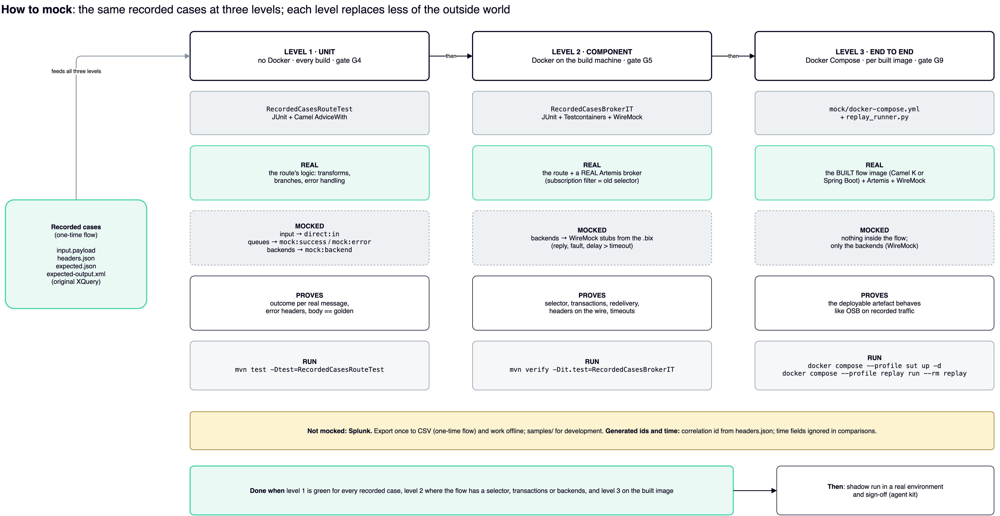

# Mocking runbook: testing a migrated OSB flow with recorded cases



"Mocking" means replacing everything outside the Camel flow with something the test controls:

| Outside the flow | In OSB it was | Mocked by |
|---|---|---|
| Input | the proxy's JMS topic/queue (with its selector) | Level 1: `direct:in` · Level 2/3: real Artemis in a container, selector as subscription filter |
| Outputs | the business services that put on queues (success, error queue) | Level 1: `mock:success`, `mock:error` · Level 2/3: real queues, read by the test |
| HTTP/SOAP backends | the business services that call HTTP/SOAP | Level 1: `mock:backend` · Level 2/3: WireMock |
| Data source | Splunk / WebLogic logs | not mocked: export once (CSV); `samples/` for development |
| Generated ids, time | `fn-bea:uuid()`, `fn:current-dateTime()` | the correlation id comes from `headers.json`; ignore time fields in comparisons |

All three levels use the **same recorded cases**, produced by the one-time flow (`docs/ONE_TIME_FLOW.md`):

```
parity/<flow>/<scenario>/<trace>/input.payload · headers.json · expected.json · expected-output.xml (golden, optional)
```

## Which level for which flow

| Flow has… | Level 1 | Level 2 | Level 3 |
|---|---|---|---|
| any logic (always) | **yes**, every build | | |
| a JMS selector, durable subscription, transactions, redelivery | yes | **yes** | |
| HTTP/SOAP backends with timeouts / retries / faults | yes (mock replies) | **yes** (WireMock delays, faults) | |
| a built image (Camel K integration or Spring Boot jar) | | | **yes**, before the shadow run |

Start with Level 1: it needs nothing but Maven, and that is where most migration bugs show.

---

## Level 1: unit tests, no Docker

**Goal:** the route's logic for every recorded case, with all boundaries replaced by Camel mock endpoints.

1. **Copy the recorded cases into the module:**
   ```bash
   cp -r work/fixtures/parity <module>/src/test/resources/
   cp work/fixtures/golden/MANIFEST.csv <module>/src/test/resources/golden/MANIFEST.csv
   ```
2. **Copy the template:** `templates/java/RecordedCasesRouteTest.java` → `<module>/src/test/java/<package>/`.
3. **Adapt the constants at the top:**
   - `ROUTE_ID`: the `routeId` of the migrated proxy;
   - `FLOW_DIR`: the folder under `parity/`;
   - `SUCCESS_URI`, `ERROR_URI`, `BACKEND_URI`: patterns of the real endpoints in the route (e.g. `amqp:queue:InboundOrderEventQueue*`).
4. **Add golden outputs:** run the **original** XQuery on each `input.payload` (the osb-to-camel skill's golden test)
   and save the result as `expected-output.xml` next to it.
5. **Run:**
   ```bash
   mvn -q test -Dtest=RecordedCasesRouteTest
   ```
   Test dependencies needed: `camel-test-spring-junit5`, `spring-boot-starter-test`, `xmlunit-assertj3`, Jackson.
6. **Read the result:** one test per recorded case, named after its folder.

| Failure | Meaning |
|---|---|
| expected on `mock:error`, got `mock:success` (or the reverse) | the outcome differs from OSB's for this real message |
| missing header | the error path does not set what OSB's error handler set |
| body differs from expected-output.xml | the transform differs from the original |

**With the agent kit:** the tester role (`/osb-test`) generates this class from the flow card; the recorded cases are
its inputs. Gate G4 runs it.

---

## Level 2: component tests with containers (Docker on the build machine)

**Goal:** prove what mocks cannot:
- the broker-side filter (the old proxy's JMS selector);
- transacted consume and redelivery;
- the headers as they really travel on AMQP;
- backend timeouts and faults.

1. **Test dependencies:** `org.testcontainers:activemq`, `org.testcontainers:junit-jupiter`, `org.wiremock:wiremock-standalone`,
   and `qpid-jms-client` (already present with `camel-amqp`).
2. **Copy the template:** `templates/java/RecordedCasesBrokerIT.java` → `<module>/src/test/java/<package>/`.
3. **Adapt:**
   - the topic, subscription, selector and queue names (from `replay-config.json`);
   - the property keys in `brokerProperties()` that the module uses for the broker URL, user, password and backend base URL.
4. **WireMock stubs:** one per business-service operation, from `templates/wiremock/backend-from-bix.json`:
   - the URL and SOAPAction from the `.bix` and WSDL;
   - the reply from the logs if OSB logged it, else from the OSB test console;
   - a **fault** variant (error path);
   - a **delayed** variant longer than the business-service timeout (retry count from the `.bix`).
5. **Run** (the `*IT` classes run in failsafe; gate G5 of the agent kit):
   ```bash
   mvn -q verify -Dit.test=RecordedCasesBrokerIT
   ```
6. **The template also contains `messagesOutsideTheSelectorAreDropped`.** OSB never logs messages its selector
   rejected, so this negative case comes from the proxy configuration.

---

## Level 3: end-to-end mock architecture (Docker Compose)

**Goal:** the built flow image as a black box, between a mock broker and mock backends, before the shadow run.

```bash
cd osb-log-replay/mock
cp .env.example .env                              # ARTEMIS_PASSWORD, SUT_IMAGE = the flow image
docker compose up -d                              # Artemis + WireMock
./setup_broker.sh                                 # topic, filtered subscription, output queues from replay-config.json
cp ../templates/wiremock/backend-from-bix.json wiremock/mappings/   # adapt first; bodies go to wiremock/__files/
docker compose --profile selftest up -d           # optional first: stub flow proves the harness
docker compose --profile replay run --rm replay   # with the stub: plumbing check
docker compose --profile selftest down
docker compose --profile sut up -d                # the real flow image
docker compose --profile replay run --rm replay   # -> ../work/report/report.json, junit.xml
```

- **The flow image** must take its broker URL, credentials and backend URL from environment variables; map them in
  `docker-compose.yml` (service `sut`).
- **Read `work/report/report.json`:** one line per recorded case and negative case, PASS or FAIL with the reason
  (wrong queue, missing header, body differs, no output).
- **Clean up:** `docker compose --profile sut --profile selftest down -v`.

---

## Troubleshooting

| Symptom | Level | Cause / fix |
|---|---|---|
| `AdviceWith` finds no node for the URI | 1 | the pattern does not match the route's URI; print `context.getRoute(ROUTE_ID)` endpoints and copy the exact prefix |
| route starts consuming from the real broker in the test | 1 | `@UseAdviceWith` missing, or the context was started before advising |
| no message on any queue | 2, 3 | the subscription filter does not match the headers (compare `headers.json` with the selector); or the flow consumes another queue name |
| negative case delivered | 2, 3 | the filter is not on the subscription queue: re-run the queue creation (`setup_broker.sh` or `@BeforeAll`) |
| `queue create` fails | 2, 3 | Artemis CLI options differ in your broker version: run `artemis queue create --help` in the container and adjust |
| body differs only in whitespace/namespace prefixes | 1, 3 | expected: comparisons are canonical; real differences remain after canonicalisation |
| timeouts in replay | 3 | the flow is not connected (check `docker compose logs sut`), or `timeout_s` too low for a cold start |

## Done when

- Level 1 is green for every recorded case of the flow.
- Level 2 is green where the flow has a selector, transactions or backends.
- Level 3 is green on the built image.

Then the flow goes to the shadow run in a real environment (agent kit, TESTING.md) and to sign-off.
